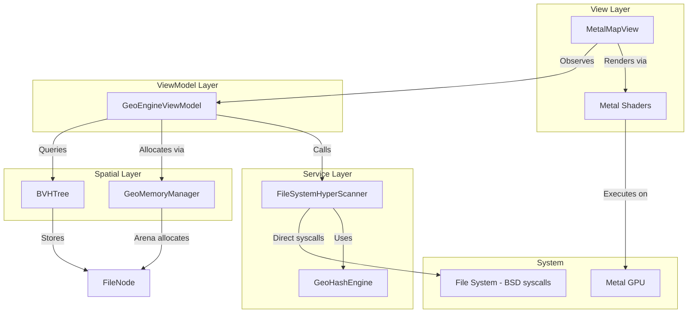
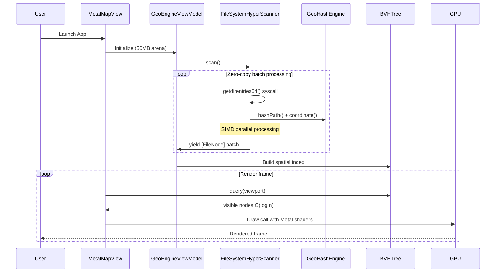

# Design Document: GeoMapper Pro

## Overview

GeoMapper Pro transforms the hierarchical file system into an immersive geographic visualization using Metal GPU rendering and advanced spatial data structures. The application employs a deterministic SIMD-optimized hash engine that converts file paths into consistent geographic coordinates, with a BVH (Bounding Volume Hierarchy) tree for O(log n) spatial queries and Metal shaders for hardware-accelerated rendering.

The system consists of six primary components:
1. **GeoHashEngine** - SIMD-optimized deterministic coordinate generation using SHA3 and Morton ordering
2. **FileSystemHyperScanner** - Lock-free actor using BSD syscalls for zero-copy directory traversal
3. **BVHTree** - GPU-friendly spatial index for O(log n) viewport queries
4. **GeoMemoryManager** - Arena-based memory allocation for 50MB target footprint
5. **GeoEngineViewModel** - Swift 6 strict concurrency state management
6. **MetalMapView** - Metal-based GPU rendering with custom shaders

## Architecture



### Data Flow



## Components and Interfaces

### GeoHashEngine

A SIMD-optimized stateless struct for deterministic coordinate generation using SHA3-512 and Morton Z-order curves.

```swift
@_assemblyVision
@_optimize(speed)
struct GeoHashEngine {
    /// 128-bit spatial identifier from path hash
    struct SpatialID {
        let high: UInt64
        let low: UInt64
    }
    
    /// Generates a 128-bit spatial hash using SHA3-512 and Morton ordering
    /// - Parameter path: The file system path string
    /// - Returns: A SpatialID with Z-order curve mapped coordinates
    @_transparent
    static func hashPath(_ path: String) -> SpatialID
    
    /// Generates SIMD2<Float> coordinate from path in O(1)
    /// - Parameter path: The file system path string
    /// - Returns: SIMD2<Float> for GPU-friendly coordinate
    @_alwaysEmitIntoClient
    static func coordinate(for path: String) -> SIMD2<Float>
    
    /// Converts Morton code to latitude using spherical Fibonacci lattice
    private static func mortonToLatitude(_ morton: UInt128) -> Double
    
    /// Converts Morton code to longitude using spherical Fibonacci lattice
    private static func mortonToLongitude(_ morton: UInt128) -> Double
}
```

**Algorithm Details:**
1. Hash path using SHA3-512 for cryptographic distribution
2. Extract 128-bit Morton code from hash digest
3. Apply Z-order curve mapping for spatial locality
4. Use spherical Fibonacci lattice for uniform Earth distribution
5. Return SIMD2<Float> for direct GPU consumption

### FileSystemHyperScanner

A lock-free actor using BSD syscalls for zero-copy directory traversal.

```swift
actor FileSystemHyperScanner: @unchecked Sendable {
    private let fd: CInt                              // File descriptor
    private let buffer: UnsafeMutableRawBufferPointer // 1MB memory-mapped buffer
    private let bvh: BVHTree                          // Spatial index reference
    
    /// Initialize with root path, opens directory with O_NONBLOCK
    init(rootPath: String) throws
    
    /// Zero-copy scan using getdirentries64 syscall
    /// - Returns: Array of FileNodes with pre-computed coordinates
    nonisolated func scan() async throws -> [FileNode]
    
    /// SIMD-parallel buffer processing
    /// Processes 1024 entries in parallel using TaskGroup
    private nonisolated func processBuffer(
        buffer: UnsafeMutableRawBufferPointer,
        count: Int,
        into nodes: inout [FileNode]
    ) async
    
    /// Process chunk of directory entries
    private nonisolated func processChunk(
        buffer: UnsafeMutableRawBufferPointer,
        start: Int,
        end: Int,
        into nodes: inout [FileNode]
    ) async
}
```

**Concurrency Strategy:**
- Direct BSD `getdirentries64` syscall - no Foundation overhead
- 1MB memory-mapped buffer for zero-copy reads
- SIMD-parallel processing in 1024-entry chunks
- `Task.yield()` every 10k files for UI responsiveness
- Pre-allocate 1M node capacity to avoid reallocations

### BVHTree

A GPU-friendly Bounding Volume Hierarchy for O(log n) spatial queries.

```swift
final class BVHTree: Sendable {
    private struct Node {
        var bounds: SIMD4<Float>                    // minX, minY, maxX, maxY
        var children: (Int32, Int32, Int32, Int32)  // 4-way branching
        var leafCount: Int32
    }
    
    private var nodes: [Node]
    private var leafNodes: [FileNode]
    
    /// Initialize with maximum tree depth
    init(maxDepth: Int)
    
    /// O(log n) viewport query with SIMD frustum culling
    /// - Parameter viewport: SIMD4<Float> bounds (minX, minY, maxX, maxY)
    /// - Returns: FileNodes visible in viewport
    @_transparent
    func query(viewport: SIMD4<Float>) -> [FileNode]
    
    /// Build BVH from unsorted nodes
    func build(from nodes: [FileNode])
    
    /// Insert single node (for incremental updates)
    func insert(_ node: FileNode)
}
```

**Query Algorithm:**
1. Start at root node (index 0)
2. SIMD bounds test: 4 comparisons in single instruction
3. If no intersection, skip subtree entirely
4. If leaf node, append all contained FileNodes
5. If internal node, push 4 children to stack
6. Continue until stack empty

### GeoMemoryManager

Arena-based memory allocation targeting 50MB footprint.

```swift
final class GeoMemoryManager {
    private let arena: UnsafeMutableRawBufferPointer
    private var offset: Int = 0
    
    /// Initialize arena with capacity in MB
    init(capacityMB: Int)
    
    /// Allocate contiguous memory for array of T
    /// - Parameter count: Number of elements
    /// - Returns: Typed buffer pointer (64-byte aligned)
    func allocate<T>(count: Int) -> UnsafeMutableBufferPointer<T>
    
    /// Zero-copy FileNode creation from arena
    func createFileNode(path: String, inode: UInt64) -> FileNode
    
    /// Reset arena for reuse (does not deallocate)
    func reset()
    
    /// Deallocate arena
    deinit
}
```

### GeoEngineViewModel

Swift 6 strict concurrency state management.

```swift
@MainActor
final class GeoEngineViewModel: ObservableObject {
    private nonisolated let scanner: FileSystemHyperScanner
    private nonisolated let memory: GeoMemoryManager
    private nonisolated let bvh: BVHTree
    
    @Published private(set) var visibleNodes: [FileNode] = []
    @Published private(set) var totalNodes: Int = 0
    @Published private(set) var isScanning: Bool = false
    @Published var viewport: SIMD4<Float> = .zero
    
    /// Initialize with 50MB memory arena
    init() throws
    
    /// Start async scan from documents directory
    func startScan() async
    
    /// Update visible nodes based on current viewport
    func updateVisibleNodes()
    
    /// Query BVH for nodes in viewport
    nonisolated func queryViewport(_ viewport: SIMD4<Float>) -> [FileNode]
}
```

### MetalMapView (UIViewRepresentable)

Metal-based GPU rendering with custom shaders.

```swift
struct MetalMapView: UIViewRepresentable {
    @ObservedObject var viewModel: GeoEngineViewModel
    
    func makeUIView(context: Context) -> MTKView
    func updateUIView(_ uiView: MTKView, context: Context)
    func makeCoordinator() -> Coordinator
    
    class Coordinator: NSObject, MTKViewDelegate {
        var parent: MetalMapView
        var device: MTLDevice
        var commandQueue: MTLCommandQueue
        var pipelineState: MTLRenderPipelineState
        var vertexBuffer: MTLBuffer?
        
        func draw(in view: MTKView)
        func mtkView(_ view: MTKView, drawableSizeWillChange size: CGSize)
    }
}
```

## Data Models

### FileNode

GPU-friendly node structure optimized for Metal rendering.

```swift
struct FileNode: Sendable {
    let id: GeoHashEngine.SpatialID  // 128-bit unique identifier
    let position: SIMD2<Float>        // GPU-ready coordinates
    let size: Float                   // Visual size for rendering
    let color: SIMD4<Float>           // RGBA color
    let inode: UInt64                 // File system inode
    let depth: UInt8                  // Hierarchy depth
    let flags: UInt8                  // Node type flags (directory/file)
}

extension FileNode {
    /// Check if node is a directory
    var isDirectory: Bool { flags & 0x01 != 0 }
    
    /// Check if node is a file
    var isFile: Bool { flags & 0x01 == 0 }
}
```

### Metal Vertex Structures

```swift
struct VertexIn {
    var position: SIMD2<Float>  // packed_float2
    var color: SIMD4<Float>     // packed_float4
    var size: Float
    var flags: UInt32
}

struct VertexOut {
    var position: SIMD4<Float>  // clip space position
    var color: SIMD4<Float>
    var uv: SIMD2<Float>
    var size: Float
}
```

### Supporting Types

```swift
/// 128-bit unsigned integer for Morton codes
struct UInt128 {
    let high: UInt64
    let low: UInt64
}

/// Configuration for memory arena
struct MemoryConfig {
    static let arenaCapacityMB: Int = 50
    static let alignment: Int = 64
    static let initialNodeCapacity: Int = 1_000_000
}

/// BVH configuration
struct BVHConfig {
    static let maxDepth: Int = 24
    static let leafThreshold: Int = 16
}
```

## Metal Shaders

### Vertex Shader

```metal
#include <metal_stdlib>
using namespace metal;

struct VertexIn {
    packed_float2 position [[attribute(0)]];
    packed_float4 color [[attribute(1)]];
    float size [[attribute(2)]];
    uint32_t flags [[attribute(3)]];
};

struct VertexOut {
    float4 position [[position]];
    float4 color;
    float2 uv;
    float size;
};

vertex VertexOut vertex_main(
    VertexIn in [[stage_in]],
    constant float4x4 &viewMatrix [[buffer(1)]],
    constant float4x4 &projectionMatrix [[buffer(2)]],
    uint instanceId [[instance_id]]
) {
    VertexOut out;
    
    // Billboard rendering for points
    float2 pos = in.position.xy;
    out.position = projectionMatrix * viewMatrix * float4(pos, 0.0, 1.0);
    out.color = in.color;
    out.uv = float2(0.0);
    out.size = in.size;
    
    return out;
}
```

### Fragment Shader

```metal
fragment float4 fragment_main(
    VertexOut in [[stage_in]],
    texture2d<float> texture [[texture(0)]],
    sampler sampler [[sampler(0)]]
) {
    // Circle rendering with anti-aliasing
    float2 uv = in.uv;
    float dist = length(uv);
    
    if (dist > 1.0) {
        discard_fragment();
    }
    
    // Smooth edge
    float alpha = 1.0 - smoothstep(0.8, 1.0, dist);
    return float4(in.color.rgb, in.color.a * alpha);
}
```

## Error Handling

### Error Types

```swift
enum GeoMapperError: Error, LocalizedError {
    case fileDescriptorFailed(String, Int32)
    case memoryArenaExhausted(Int)
    case bvhBuildFailed(String)
    case metalDeviceNotFound
    case shaderCompilationFailed(String)
    case scanCancelled
    
    var errorDescription: String? {
        switch self {
        case .fileDescriptorFailed(let path, let errno):
            return "Failed to open \(path): errno \(errno)"
        case .memoryArenaExhausted(let requested):
            return "Memory arena exhausted, requested \(requested) bytes"
        case .bvhBuildFailed(let reason):
            return "BVH build failed: \(reason)"
        case .metalDeviceNotFound:
            return "No Metal-capable GPU found"
        case .shaderCompilationFailed(let name):
            return "Shader compilation failed: \(name)"
        case .scanCancelled:
            return "Scan was cancelled"
        }
    }
}
```

### Error Handling Strategy

1. **File Descriptor Errors**: Wrap POSIX errors, skip inaccessible directories
2. **Memory Exhaustion**: Fatal error with diagnostic, arena is pre-sized
3. **BVH Failures**: Fallback to linear scan if tree build fails
4. **Metal Errors**: Graceful degradation message, require Metal-capable device
5. **Cancellation**: Clean up file descriptors and buffers


## Correctness Properties

*A property is a characteristic or behavior that should hold true across all valid executions of a system—essentially, a formal statement about what the system should do. Properties serve as the bridge between human-readable specifications and machine-verifiable correctness guarantees.*

The following properties are derived from the acceptance criteria and will be validated using property-based testing with SwiftCheck.

### Property 1: Hash Determinism

*For any* valid file path string, calling `GeoHashEngine.hashPath(_:)` multiple times SHALL always return identical `SpatialID` values with the same high and low components.

**Validates: Requirements 1.1, 1.2**

### Property 2: Coordinate Determinism

*For any* valid file path string, calling `GeoHashEngine.coordinate(for:)` multiple times SHALL always return identical `SIMD2<Float>` values.

**Validates: Requirements 1.2**

### Property 3: Coordinate Bounds Invariant

*For any* file path string, the generated SIMD2<Float> coordinate SHALL have components that map to valid geographic bounds when interpreted as latitude/longitude.

**Validates: Requirements 1.4**

### Property 4: BVH Query Correctness

*For any* viewport bounds and set of FileNodes, the BVH query SHALL return exactly the nodes whose positions fall within the viewport bounds. No nodes outside the viewport SHALL be returned, and no nodes inside SHALL be omitted.

**Validates: Requirements 5.1, 5.2, 5.3, 5.4**

### Property 5: BVH Query Completeness

*For any* set of FileNodes inserted into the BVH, querying with a viewport that encompasses all nodes SHALL return all nodes.

**Validates: Requirements 5.4**

### Property 6: Memory Arena Allocation Consistency

*For any* sequence of allocations from GeoMemoryManager, all returned pointers SHALL be 64-byte aligned and non-overlapping.

**Validates: Requirements 8.1**

### Property 7: FileNode ID Uniqueness

*For any* collection of FileNodes created from distinct file paths, all SpatialID values SHALL be unique.

**Validates: Requirements 6.1**

### Property 8: Scanner Error Resilience

*For any* directory containing a mix of accessible and inaccessible items, the FileSystemHyperScanner SHALL yield FileNodes for all accessible items and continue scanning despite encountering permission errors.

**Validates: Requirements 3.5**

### Property 9: SIMD Bounds Test Equivalence

*For any* viewport and node bounds, the SIMD-accelerated bounds test SHALL produce the same result as a scalar implementation.

**Validates: Requirements 8.2**

## Testing Strategy

### Property-Based Testing Framework

The project will use **SwiftCheck** for property-based testing, which provides:
- Arbitrary generators for random test data
- Shrinking for minimal failing examples
- Integration with XCTest

### Test Configuration

```swift
// Each property test runs minimum 100 iterations
let testConfig = CheckerArguments(
    replay: nil,
    maxAllowableSuccessfulTests: 100,
    maxAllowableDiscardedTests: 500,
    maxTestCaseSize: 100
)
```

### Dual Testing Approach

**Unit Tests** will cover:
- Specific coordinate examples for known paths
- Edge cases (empty paths, special characters, very long paths)
- Metal shader compilation verification
- BVH tree structure validation
- Memory arena boundary conditions

**Property-Based Tests** will cover:
- All 9 correctness properties defined above
- Universal behaviors across random inputs
- Invariants that must hold for all valid inputs

### Test Organization

```
Tests/
├── GeoMapperProTests/
│   ├── GeoHashEngineTests.swift              # Unit tests
│   ├── GeoHashEnginePropertyTests.swift      # Properties 1-3
│   ├── FileSystemHyperScannerTests.swift     # Unit tests
│   ├── FileSystemHyperScannerPropertyTests.swift  # Property 8
│   ├── BVHTreeTests.swift                    # Unit tests
│   ├── BVHTreePropertyTests.swift            # Properties 4-5, 9
│   ├── GeoMemoryManagerTests.swift           # Unit tests
│   ├── GeoMemoryManagerPropertyTests.swift   # Property 6
│   └── FileNodeTests.swift                   # Property 7
```

### Generator Strategy

Custom generators will be created for:
- Valid file path strings (with various depths, characters, lengths)
- FileNode instances with valid SIMD coordinates
- SIMD4<Float> viewport bounds
- Directory hierarchies for scanner testing

```swift
// Example generator for file paths
extension String {
    static var arbitraryFilePath: Gen<String> {
        Gen<String>.compose { c in
            let depth = c.generate(using: Gen.fromElements(in: 1...10))
            let components = (0..<depth).map { _ in
                c.generate(using: Gen.fromElements(of: validPathComponents))
            }
            return "/" + components.joined(separator: "/")
        }
    }
}

// Example generator for SIMD4 viewport
extension SIMD4 where Scalar == Float {
    static var arbitraryViewport: Gen<SIMD4<Float>> {
        Gen<SIMD4<Float>>.compose { c in
            let minX = c.generate(using: Gen.fromElements(in: -180.0...0.0))
            let minY = c.generate(using: Gen.fromElements(in: -90.0...0.0))
            let maxX = c.generate(using: Gen.fromElements(in: minX...180.0))
            let maxY = c.generate(using: Gen.fromElements(in: minY...90.0))
            return SIMD4<Float>(Float(minX), Float(minY), Float(maxX), Float(maxY))
        }
    }
}
```
